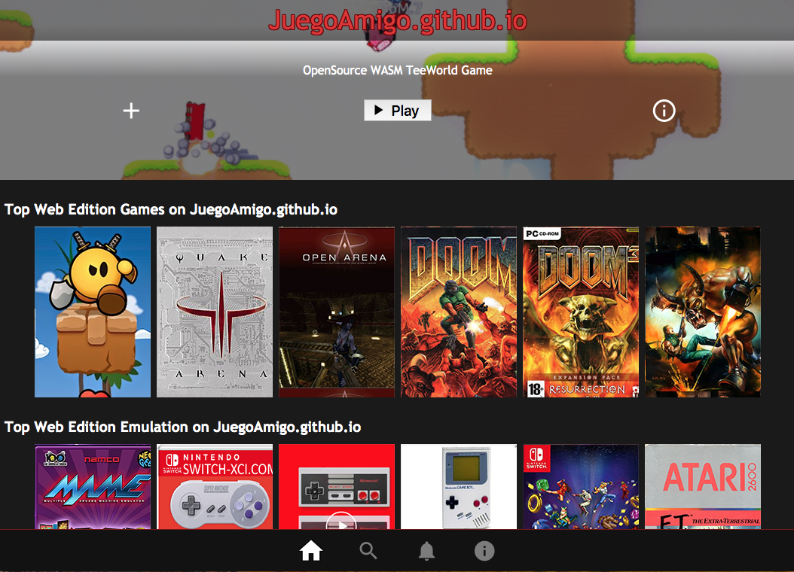

# juegoamigo.github.io
Make your own Videogame portal in internet using GitHub pages. Just FORK this repo.
In this portal you can play online without install nothing and using your browser to the best OpenSource games and based on WASM (WebAssembly technology, that converts C/C++ code in Javascript) You can play some games from desktop, and others from mobile! There are webs with a lot of old-retro games, if you have the original game in your home, you can play it in a legal way. Games like Quake 3, Doom 3, OpenArena, TeeWorlds, Minecraft with modpacks, MineTest, indie games like the famous Maldita Castilla, and super emulators like Dolphin, etc. Just enter and play! (yourself or with your family or friends in LAN mode or Internet multiplayer mode).
This is not streaming like Google Stadia but is similar experience!

## Link to the portal: https://juegoamigo.github.io/

## html5 template based on the Webflix template
Based on the source of: https://zuixjs.github.io/zuix-web-flix/
The template is similar to Netflix UI

# Modify the files:
## index.html
To change the title (header) and to add your moneybutton html code.
header:
```
<title>JuegoAmigo.github.io - The best free WASM OpenSource games!</title>
```
Moneybutton code (To accept donations in Bitcoin (SV) Satoshi Vision):
More info: https://www.moneybutton.com/
```
<dd style = "top:0;right:-1;position:absolute;z-index: 9999">
<!-- This line should go where you want to put your button -->
<div class="money-button"
  data-to="8986"
  data-amount=""
  data-currency="EUR"
  data-label="Donar"
  data-client-identifier="a1291c20c1ee392504a84dd296b71846"
  data-button-id="1564760808656"
  data-button-data="{'ID':'JUEGOAMIGO'}"
  data-type="buy",
  data-editable="true",
  data-disabled="false",
  data-dev-mode="false"
></div>
<!-- This line can go anywhere -->
<script src="https://www.moneybutton.com/moneybutton.js"></script>
</dd>
```

## index.js
To change the header image/animatedgif and cover of the web:
```
 mainPage = this.cover({
                "vote_average":9.1,
                "title":"TeeWorld Web Edition",
                "poster_path":"images\/teeworld_portrait.jpg",
                "backdrop_path":"images\/teeworld_animated.gif",
                "overview":"Teeworlds is a retro multiplayer shooter game.\nThis unofficial version runs in your browser thanks to the Cheerp compiler.\nFor more information and issue tracking, please visit the Github page.\nHow does this work? Find out in our blog post!\nBelow, you can create a new server, or join an existing one.\nIn either case, click on a server link to play.\nCopy it and share it with your friends so they can join the same server easily!\nIf you create your own server, please don't close the tab while you are still playing.\nThe server runs in your browser just as the client, and they communicate directly through WebRTC.",
                "release_date":"2007-05-27",
                "trailer": "https://teeworlds.leaningtech.com/"
            });
```

## app.bundle.js
To change the lists of items. Each item has this html code:
```
<div class=\"movie\">\n<span title=\"Maldita Castilla\" data-ui-lazyload=\"true\" style=\"background-image:url(images/maldita_castilla.jpg)\" onclick=\"location.href='https://www.locomalito.com/index.php';\" class=\"item\"><!-- no-view --></span>\n</div>\n
```

And the list of items are:
```
, {
    componentId:"pages/home/list_top_rated", view:"<h1 self=\"left\">Top Web Edition Games on JuegoAmigo.github.io</h1>\n<div data-ui-load=\"@lib/controllers/view_pager\"\n     data-ui-lazyload=\"auto\"\n     data-o-passive=\"false\"\n     layout=\"row top-left\"\n     class=\"gallery\">\n    <div class=\"movie\">\n<span title=\"TeeWorld Web Edition\" data-ui-lazyload=\"true\" style=\"background-image:url(images/teeworld.png)\" onclick=\"location.href='https://teeworlds.leaningtech.com/';\" class=\"item\"><!-- no-view --></span>\n</div>\n<div class=\"movie\">\n<span title=\"Quake Web Edition\" data-ui-lazyload=\"true\" style=\"background-image:url(images/quake3.jpg)\" onclick=\"location.href='http://www.quakejs.com/';\" class=\"item\"><!-- no-view --></span>\n</div>\n<div class=\"movie\">\n<span title=\"Quake Web Edition\" data-ui-lazyload=\"true\" style=\"background-image:url(images/openarena.jpg)\" onclick=\"location.href='https://openarena.live/';\" class=\"item\"><!-- no-view --></span>\n</div>\n<div class=\"movie\">\n<span title=\"Doom Web Edition\" data-ui-lazyload=\"true\" style=\"background-image:url(images/doom.jpg)\" onclick=\"location.href='http://kripken.github.io/boon/boon.html';\" class=\"item\"><!-- no-view --></span>\n</div>\n<div class=\"movie\">\n<span title=\"Doom 3 Web Edition\" data-ui-lazyload=\"true\" style=\"background-image:url(images/doom3.jpg)\" onclick=\"location.href='http://wasm.continuation-labs.com/d3demo/';\" class=\"item\"><!-- no-view --></span>\n</div>\n<div class=\"movie\">\n<span title=\"BananaBread Web Edition\" data-ui-lazyload=\"true\" style=\"background-image:url(images/banana.jpg)\" onclick=\"location.href='https://kripken.github.io/BananaBread/cube2/bb.html';\" class=\"item\"><!-- no-view --></span>\n</div>\n    \n    </div>\n</div>\n", css:null, controller:function() {}
}

, {
    componentId:"pages/home/list_tv_series", view:"<h1 self=\"left\">Top Web Edition Emulation on JuegoAmigo.github.io</h1>\n<div data-ui-load=\"@lib/controllers/view_pager\"\n     data-ui-lazyload=\"auto\"\n     data-o-passive=\"false\"\n     layout=\"row top-left\"\n     class=\"gallery\">\n   <div class=\"movie\">\n<span title=\"Emulatrix Web Edition\" data-ui-lazyload=\"true\" style=\"background-image:url(images/emulatrix.png)\" onclick=\"location.href='https://lrusso.github.io/Emulatrix/Emulatrix.htm';\" class=\"item\"><!-- no-view --></span>\n</div>\n<div class=\"movie\">\n<span title=\"Emulatrix Web Edition\" data-ui-lazyload=\"true\" style=\"background-image:url(images/snes.png)\" onclick=\"location.href='https://www.playemulator.com/snes-online/';\" class=\"item\"><!-- no-view --></span>\n</div>\n<div class=\"movie\">\n<span title=\"Emulatrix Web Edition\" data-ui-lazyload=\"true\" style=\"background-image:url(images/nes.png)\" onclick=\"location.href='https://www.playemulator.com/nes-online/';\" class=\"item\"><!-- no-view --></span>\n</div>\n<div class=\"movie\">\n<span title=\"Emulatrix Web Edition\" data-ui-lazyload=\"true\" style=\"background-image:url(images/gameboy.png)\" onclick=\"location.href='https://www.playemulator.com/gbc-online/';\" class=\"item\"><!-- no-view --></span>\n</div>\n<div class=\"movie\">\n<span title=\"Emulatrix Web Edition\" data-ui-lazyload=\"true\" style=\"background-image:url(images/megadrive.jpg)\" onclick=\"location.href='https://www.playemulator.com/sega-online/';\" class=\"item\"><!-- no-view --></span>\n</div>\n<div class=\"movie\">\n<span title=\"Atari 2600\" data-ui-lazyload=\"true\" style=\"background-image:url(images/atari.jpg)\" onclick=\"location.href='http://www.free80sarcade.com/all2600games.php';\" class=\"item\"><!-- no-view --></span>\n</div>\n    </div>\n</div>\n", css:null, controller:function() {}
}

, {
    componentId:"pages/home/list_comedy", view:"<h1 self=\"left\">Top Web Edition O.S. on JuegoAmigo.github.io</h1>\n<div data-ui-load=\"@lib/controllers/view_pager\"\n     data-ui-lazyload=\"auto\"\n     data-o-passive=\"false\"\n     layout=\"row top-left\"\n     class=\"gallery\">\n<div class=\"movie\">\n<span title=\"Windows 95\" data-ui-lazyload=\"true\" style=\"background-image:url(images/win95.jpg)\" onclick=\"location.href='https://win95.ajf.me/win95.html';\" class=\"item\"><!-- no-view --></span>\n</div>\n<div class=\"movie\">\n<span title=\"MacOS 7\" data-ui-lazyload=\"true\" style=\"background-image:url(images/macos.png)\" onclick=\"location.href='http://jamesfriend.com.au/pce-js/';\" class=\"item\"><!-- no-view --></span>\n</div>\n<div class=\"movie\">\n<span title=\"ZX Spectrum\" data-ui-lazyload=\"true\" style=\"background-image:url(images/spectrum.jpg)\" onclick=\"location.href='http://www.top80sgames.com/site/systems/zx-spectrum-128k';\" class=\"item\"><!-- no-view --></span>\n</div>\n<div class=\"movie\">\n<span title=\"MSX\" data-ui-lazyload=\"true\" style=\"background-image:url(images/msx.jpg)\" onclick=\"location.href='http://www.top80sgames.com/site/systems/msx';\" class=\"item\"><!-- no-view --></span>\n</div>\n<div class=\"movie\">\n<span title=\"Commodore 64\" data-ui-lazyload=\"true\" style=\"background-image:url(images/commodore.jpg)\" onclick=\"location.href='http://www.top80sgames.com/site/systems/commodore-64';\" class=\"item\"><!-- no-view --></span>\n</div>\n<div class=\"movie\">\n<span title=\"Capcom\" data-ui-lazyload=\"true\" style=\"background-image:url(images/capcom.jpg)\" onclick=\"location.href='https://www.playemulator.com/cps2-online/';\" class=\"item\"><!-- no-view --></span>\n</div>\n      </div>\n</div>\n", css:null, controller:function() {}
}
, {
    componentId:"pages/home/list_central", view:"<h1 self=\"left\">Top Multi-System games on JuegoAmigo.github.io</h1>\n<div data-ui-load=\"@lib/controllers/view_pager\"\n     data-ui-lazyload=\"auto\"\n     data-o-passive=\"false\"\n     layout=\"row top-left\"\n     class=\"gallery\">\n<div class=\"movie\">\n<span title=\"Dolphin Wii and GameCube emu\" data-ui-lazyload=\"true\" style=\"background-image:url(images/dolphin.jpg)\" onclick=\"location.href='https://dolphin-emu.org/download/?ref=btn';\" class=\"item\"><!-- no-view --></span>\n</div>\n<div class=\"movie\">\n<span title=\"TeeWorlds for all systems\" data-ui-lazyload=\"true\" style=\"background-image:url(images/teeworldwin.jpg)\" onclick=\"location.href='https://www.teeworlds.com/?page=downloads';\" class=\"item\"><!-- no-view --></span>\n</div>\n<div class=\"movie\">\n<span title=\"TLauncher Minecraft\" data-ui-lazyload=\"true\" style=\"background-image:url(images/minecraft.jpg)\" onclick=\"location.href='https://tlauncher.org/en/';\" class=\"item\"><!-- no-view --></span>\n</div>\n<div class=\"movie\">\n<span title=\"Minetest\" data-ui-lazyload=\"true\" style=\"background-image:url(images/minetest.jpg)\" onclick=\"location.href='https://www.minetest.net/downloads/';\" class=\"item\"><!-- no-view --></span>\n</div>\n<div class=\"movie\">\n<span title=\"Maldita Castilla\" data-ui-lazyload=\"true\" style=\"background-image:url(images/maldita_castilla.jpg)\" onclick=\"location.href='https://www.locomalito.com/index.php';\" class=\"item\"><!-- no-view --></span>\n</div>\n      </div>\n</div>\n", css:null, controller:function() {}
}

```
By MrAddon. 
https://mraddon.blog/
